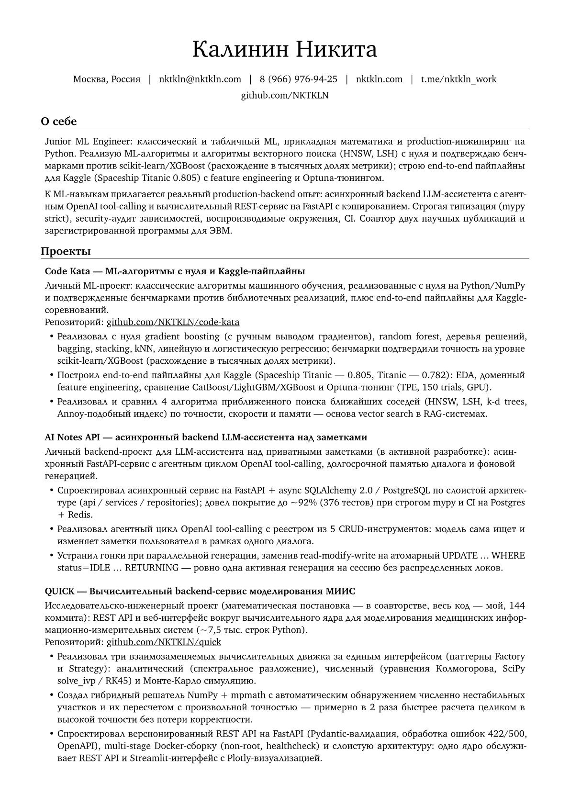
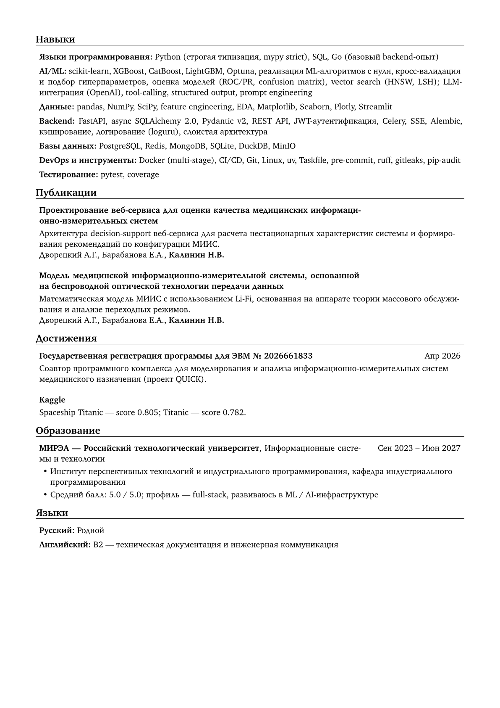

# 📄 Резюме

Этот репозиторий содержит исходные файлы и автоматизацию, необходимые для создания резюме с помощью [RenderCV](https://github.com/rendercv/rendercv). Содержимое и дизайн резюме хранятся в YAML-файлах, а итоговые PDF- и Typst-файлы генерируются в директорию `output/`.

## 🚀 Актуальная версия резюме

<p align="center">
  
  
</p>

Текущая PDF-версия доступна здесь: [Kalinin_Nikita_CV.pdf](output/Kalinin_Nikita_CV.pdf)

## 📦 Зависимости

- [Python 3.13+](https://www.python.org/downloads/)
- [uv](https://docs.astral.sh/uv/getting-started/installation/)
- [Task](https://taskfile.dev/)

## ⚡ Быстрый старт

Установите все зависимости проекта:

```bash
task sync
```

Сгенерируйте резюме:

```bash
task render
```

Сгенерированные файлы будут сохранены в директории `output/`. По умолчанию основными выходными файлами являются:

- `output/Kalinin_Nikita_CV.pdf`
- `output/Kalinin_Nikita_CV.typ`

Перед генерацией можно проверить YAML на соответствие схеме RenderCV:

```bash
task validate
```

После внесения изменений заново сгенерируйте резюме:

```bash
task render
```

## 📁 Структура проекта

```text
cv/
  data.yaml      # Содержимое резюме: личные данные, образование, опыт, навыки и проекты
  design.yaml    # Конфигурация макета и дизайна RenderCV
docs/
  resume-rules.md            # Правила сильного инженерного резюме (чек-лист для data.yaml)
projects/        # Разборы проектов — источник честных фактов и буллетов для резюме
prompts/
  project-analysis-prompt.md # Промт для генерации новых разборов проектов
output/          # Сгенерированные файлы резюме
Taskfile.yml     # Команды автоматизации для установки, проверки, генерации и релизов
pyproject.toml   # Метаданные Python-проекта и зависимости
```

## ✏️ Редактирование резюме

Обновляйте содержимое резюме в файле:

```text
cv/data.yaml
```

Настраивайте макет, типографику и стили в файле:

```text
cv/design.yaml
```

## 🧰 Вспомогательные материалы

- [`docs/resume-rules.md`](docs/resume-rules.md) — свод правил сильного инженерного
  резюме и чек-лист перед сборкой.
- [`projects/`](projects/) — разборы проектов под целевую роль: честное
  позиционирование, готовые буллеты и ATS-ключевики. Источник фактов для `data.yaml`.
- [`prompts/project-analysis-prompt.md`](prompts/project-analysis-prompt.md) — промт
  для генерации новых разборов в том же формате.

## 🤖 Claude Skills workflow

В репозиторий добавлены project-local Claude Code skills для улучшения резюме:

```text
/cv-pipeline
/diagnoser
/recruiter
/rewriter
/hiring-manager
/application-pack
```

Они используют `cv/data.yaml` как источник резюме, `docs/resume-rules.md` как правила качества и `projects/*.md` как доказательную базу для фактов.

Подробности: [`docs/claude-skills.md`](docs/claude-skills.md).
